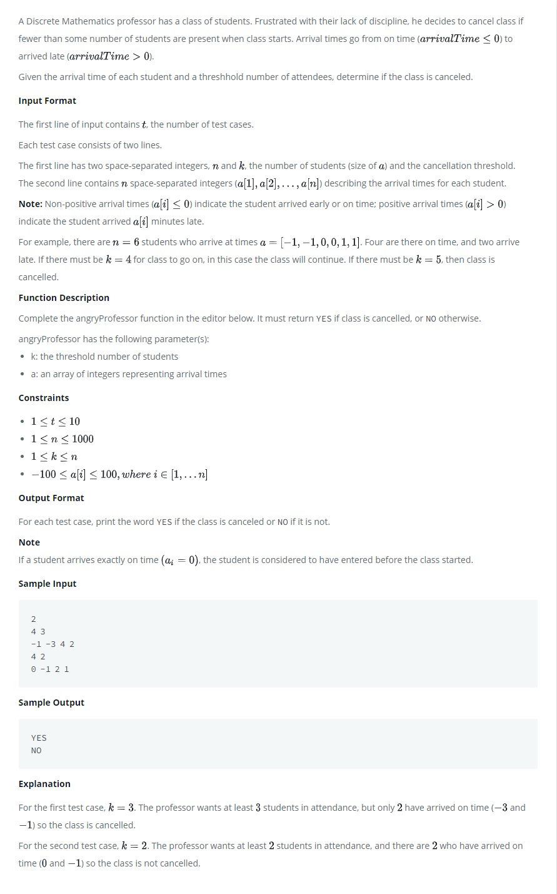

# Angry Professor

A Discrete Mathematics professor has a class of students. Frustrated with their lack of discipline, he decides to cancel class if fewer than some number of students are present when class starts.

<kbd></kbd>

