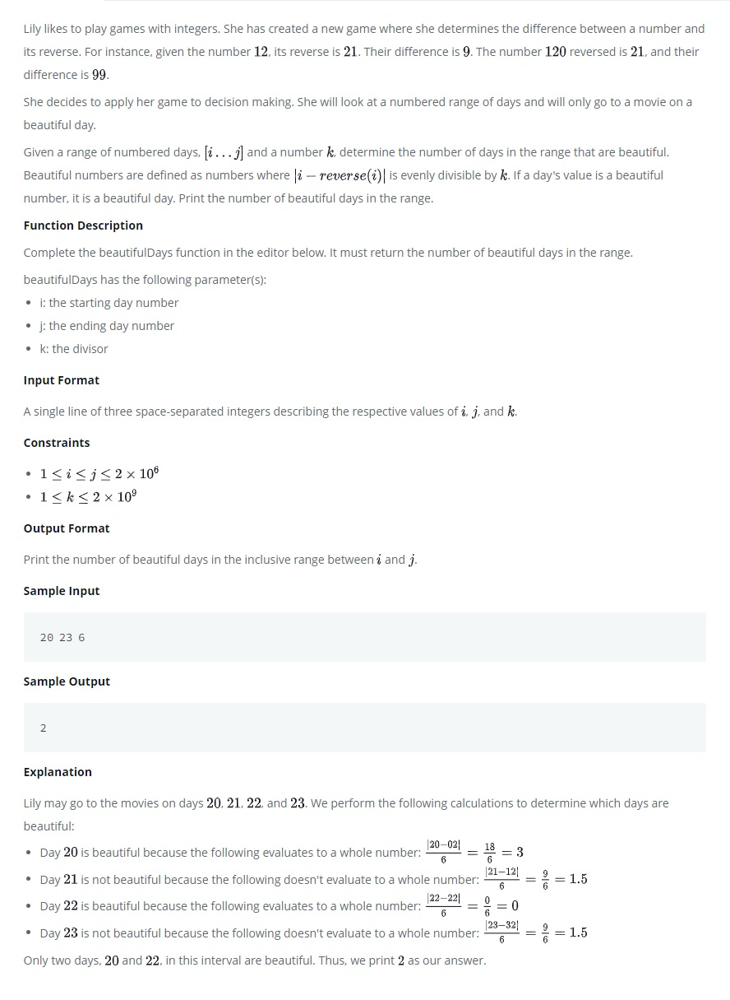

# Beautiful Days at the Movies

Lily likes to play games with integers. She has created a new game where she determines the difference between a number and its reverse. For instance, given the number 12, its reverse is 21. Their difference is 9. The number 120 reversed is 21, and their difference is 99.

<kbd></kbd>

