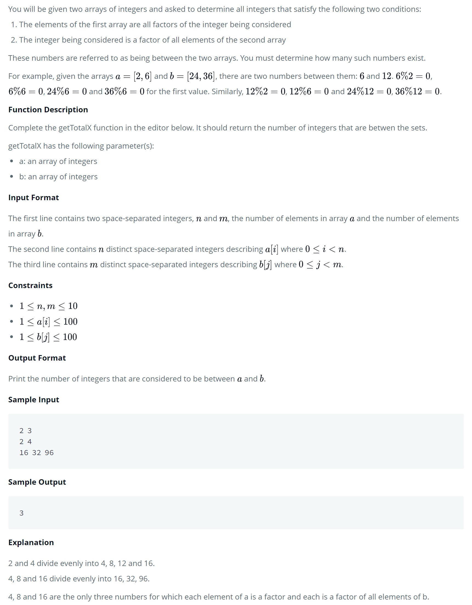

# Between Two Sets

You will be given two arrays of integers and asked to determine all integers that satisfy the following two conditions:

1. The elements of the first array are all factors of the integer being considered
2. The integer being considered is a factor of all elements of the second array

These numbers are referred to as being *between* the two arrays. You must determine how many such numbers exist.

<kbd></kbd>
