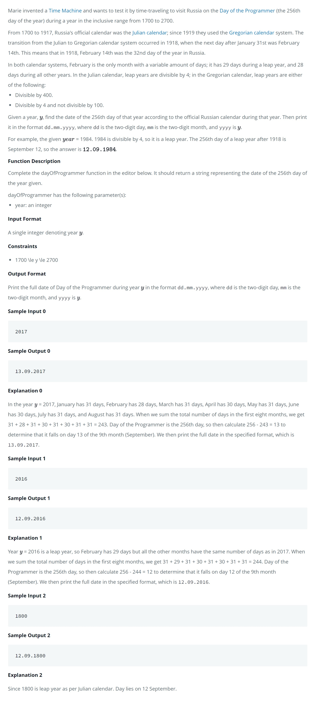

# Day of the Programmer

Marie invented a [Time Machine](https://en.wikipedia.org/wiki/Time_machine) and wants to test it by time-traveling to visit Russia on the [Day of the Programmer](https://en.wikipedia.org/wiki/Day_of_the_Programmer) (the 256th day of the year) during a year in the inclusive range from 1700 to 2700.

From 1700 to 1917, Russia's official calendar was the [Julian calendar](https://en.wikipedia.org/wiki/Julian_calendar); since 1919 they used the [Gregorian calendar](https://en.wikipedia.org/wiki/Gregorian_calendar) system. The transition from the Julian to Gregorian calendar system occurred in 1918, when the next day after January 31st was February 14th. This means that in 1918, February 14th was the 32nd day of the year in Russia.

In both calendar systems, February is the only month with a variable amount of days; it has 29 days during a *leap year*, and 28 days during all other years. In the Julian calendar, leap years are divisible by 4; in the Gregorian calendar, leap years are either of the following:

* Divisible by 400.
* Divisible by 4 and *not* divisible by 100.

<kbd></kbd>

