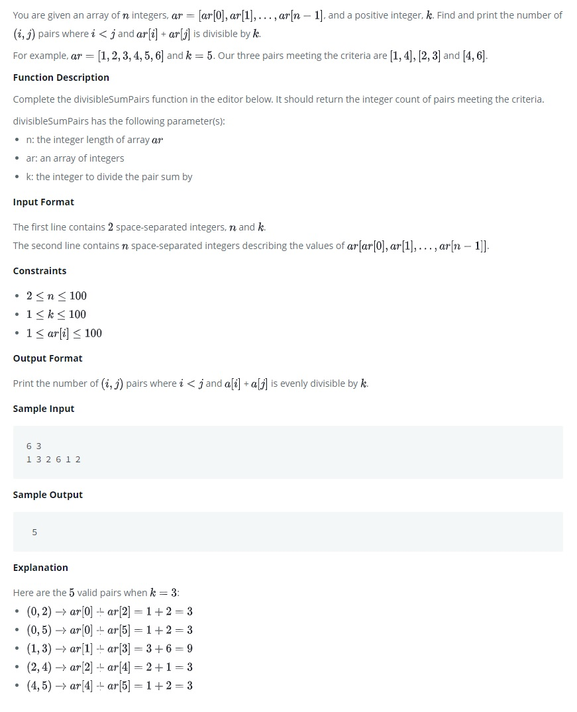

# Divisible Sum Pairs

You are given an array of n integers ar, and a positive integer, k. Find and print the number of (i, j) pairs where i<j and  ar[i]+ar[j] is divisible by k.

For example, ar=[1, 2, 3, 4, 5, 6] and k=5. Our three pairs meeting the criteria are [1, 4], [2, 3] and [4, 6].

<kbd></kbd>

