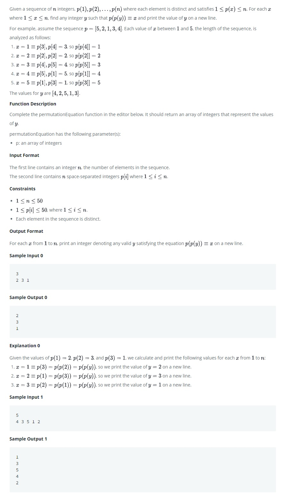

# Sequence Equation

Given a sequence of n integers, p(1), p(2),...,p(n) where each element is distinct and satisfies 1 <= p(x) <= n. For *each*  x where a <= x <=n, find any integer y such that p(p(y)) = x and print the value of y on a new line.

<kbd></kbd>

