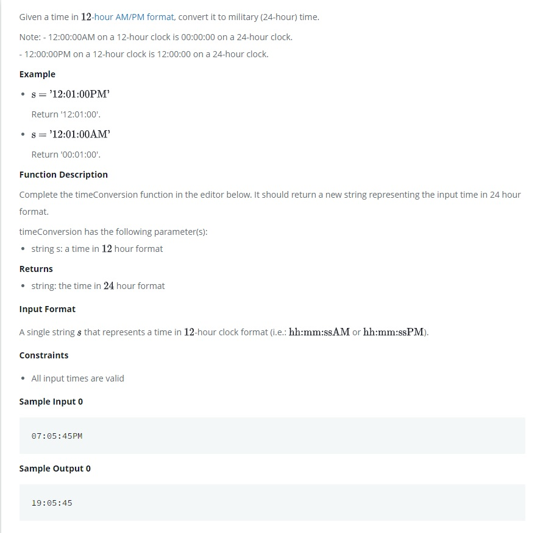

# Time Conversion

Given a time in 12 [-hour AM/PM format](https://en.wikipedia.org/wiki/12-hour_clock), convert it to military (24-hour) time.

Note:

- 12:00:00AM on a 12-hour clock is 00:00:00 on a 24-hour clock.

- 12:00:00PM on a 12-hour clock is 12:00:00 on a 24-hour clock.

<kbd></kbd>

